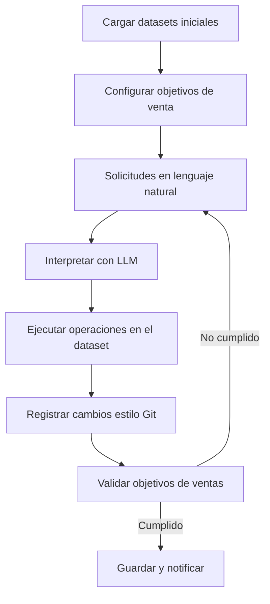

# Proyecto: Sistema de Ajuste de Pronósticos de Ventas Basado en Lenguaje Natural

## **Descripción General**
Este proyecto tiene como objetivo desarrollar un sistema que permita a vendedores ajustar un dataset de pronósticos de ventas futuras utilizando lenguaje natural. Esto permite que personas sin conocimientos técnicos puedan modificar los datos de manera eficiente, asegurando que los totales ajustados reflejen los objetivos de ventas de la compañía. Además, el sistema incluye un mecanismo de registro de cambios estilo Git para garantizar trazabilidad y control de versiones.

---

## **Componentes Principales del Sistema**

### **1. Datasets Involucrados**
- **Ventas históricas:**
  - Datos reales de ventas pasadas.
  - Incluyen columnas como:
    - Producto.
    - Cliente.
    - Mes.
    - Cantidad vendida.
    - Ingresos generados.

- **Pronósticos futuros:**
  - Datos estimados para las ventas futuras generados por métodos estadísticos.
  - Mismo nivel de detalle que las ventas históricas.

---

### **2. Modelo de Lenguaje Natural (LLM)**
- Permite a los vendedores interactuar con el sistema utilizando lenguaje natural.
- Traduce solicitudes a operaciones específicas sobre los datos.
  - Ejemplo: "Incrementa las ventas del cliente X en enero en $5,000."
  - Salida: Operación en Python para modificar el dataset.

---

### **3. Control de Cambios Estilo Git**
- Cada operación realizada sobre el dataset se registra como un commit.
- **Contenido del commit:**
  - Fecha y hora.
  - Usuario que realizó el cambio.
  - Operación ejecutada.
  - Diferencias entre el dataset original y el modificado.

- **Ejemplo de Registro:**
  ```json
  {
      "user": "Juan Perez",
      "timestamp": "2025-01-07T10:00:00",
      "operation": "Incremento de ventas en $5000 para cliente X en enero",
      "diff": {
          "index": 123,
          "original": {"Cantidad": 10000},
          "modified": {"Cantidad": 15000}
      }
  }
  ```

---

### **4. Interfaz de Usuario (UI)**
- Permite a los vendedores:
  - Ingresar solicitudes en lenguaje natural.
  - Visualizar los datos antes y después de los ajustes.
  - Confirmar o revertir cambios.
- **Tecnologías sugeridas:**
  - FastAPI + Streamlit o Gradio.

---

## **Flujo de Trabajo**


---

## **Detalles de Implementación**

### **1. Interpretación de Solicitudes**
El modelo LLM traduce solicitudes en lenguaje natural a operaciones Python. Ejemplo:
- **Entrada:** "Reduce las ventas del producto Y en febrero en un 10%."
- **Salida (código Python):**
  ```python
  dataset.loc[(dataset['Producto'] == 'Y') & (dataset['Mes'] == 'Febrero'), 'Cantidad'] *= 0.9
  ```

### **2. Registro de Cambios**
- Cada modificación se registra como un commit:
  - Incluye un diff calculado con Pandas:
    ```python
    diff = modified_dataset.compare(original_dataset)
    ```
  - El commit se guarda en un archivo JSON:
    ```python
    with open("commit_log.json", "a") as log_file:
        log_file.write(json.dumps(commit) + "\n")
    ```

- **Reversión de cambios:**
  - Los commits incluyen el estado original de las filas afectadas para revertir si es necesario.

### **3. Interfaz para los Vendedores**
- **Entrada:** Lenguaje natural.
- **Salida:**
  - Confirmación de cambios realizados.
  - Visualización de cómo los ajustes impactan los objetivos de ventas.

---

## **Beneficios del Sistema**
1. **Accesibilidad:** Los vendedores pueden ajustar datos sin conocimientos técnicos.
2. **Trazabilidad:** Cada cambio queda registrado, asegurando transparencia.
3. **Cumplimiento de objetivos:** Los ajustes alinean los datos con las metas de la compañía.
4. **Flexibilidad:** Los cambios pueden revertirse y auditarse fácilmente.

---

## **Próximos Pasos**
1. Construir un prototipo inicial que permita:
   - Cargar datasets.
   - Procesar solicitudes simples con un LLM.
   - Registrar cambios en formato JSON.
2. Diseñar la interfaz para vendedores.
3. Probar el sistema con datos reales.

---

## **Tecnologías Sugeridas**
- **Procesamiento de datos:** Pandas, Dask (si los datos son grandes).
- **Modelo de lenguaje:** OpenAI GPT o equivalente.
- **Backend:** FastAPI.
- **Frontend:** Streamlit o Gradio.
- **Control de cambios:** JSON para commits; opcionalmente, una base de datos relacional.

---
